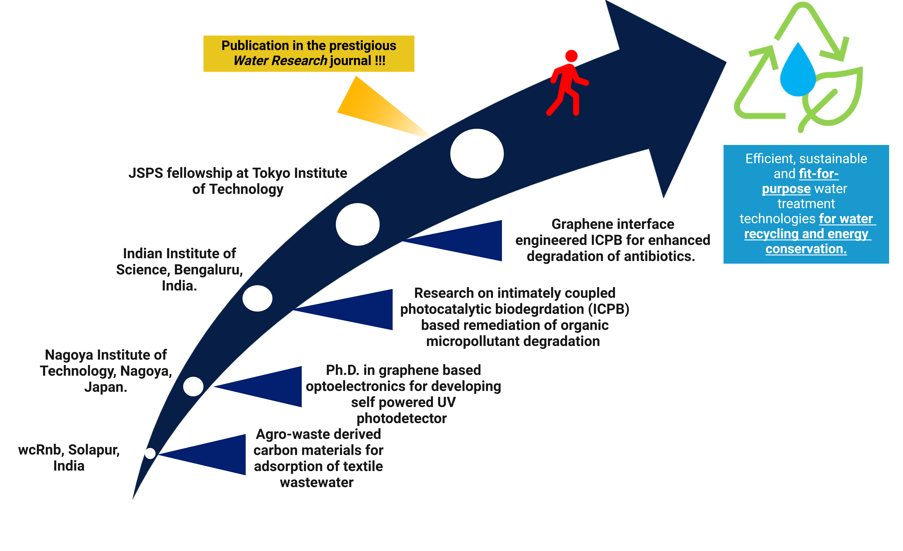
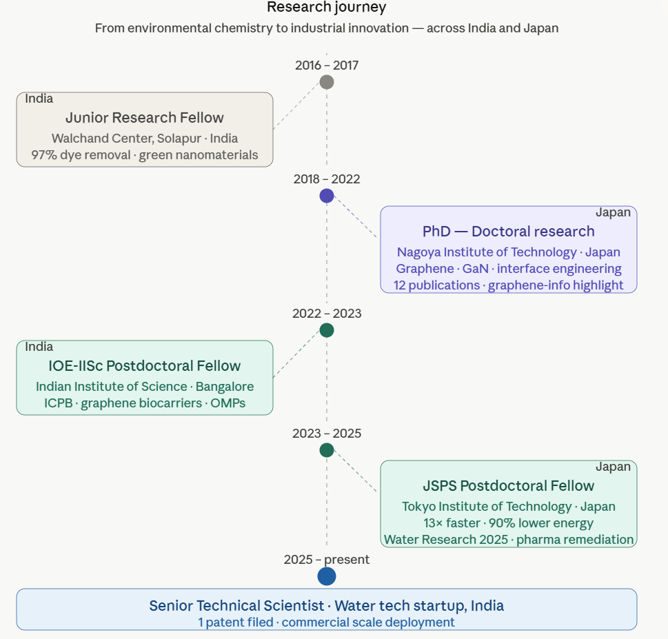

<!--

-->



```{=html}
<!--
::: {style="text-align: justify"}
After finishing my M.Sc. in Analytical Chemistry from R. Ruia College, Mumbai University, I worked as a Junior Research Fellow (JRF) at Walchand Center for Research in Nanotechnology and Bio-nanotechnology (wcRnb), Solapur, India. During my research journey at wcRnb, I was introduced to carbon nanotechnology. During the JRF project, I aimed to fabricate green carbon nanomaterials from agricultural waste products (otherwise burned away and causing air pollution) for environmental remediation. [***As an environmentalist, I consciously designed a project focusing on environmental conservation with a strong commitment to solving local water pollution problems.***]{.underline} The project focused on solving local textile wastewater pollution by fabricating and utilizing green-carbon material-based adsorbents (fabricated using agricultural waste prodcuts otherwise burnt away to cause air pollution) to remove widely utilized reactive red 141 (RR141) dye in local textile companies. Under highly acidic conditions, a 97% dye removal efficiency in 30 minutes of contact time was achieved.

After my JRF tenure, intrigued by various applications of carbon nanomaterials, especially the sophisticated wonder material “graphene” and its potential in semiconductor technology, I pursued my doctoral studies under the supervision of Dr. Golap Kalita at the prestigious Department of Physical Science and Engineering, Nagoya Institute of Technology, Nagoya, Japan. My doctoral research focused on fabricating (using low-pressure chemical vapour deposition) and integrating monolayer graphene with wide band-gap semiconductors, i.e. gallium nitride (GaN) and gallium oxide (Ga 2 O 3 ), to produce self-powered, high-temperature stable UV and deep-UV photoresponsive devices. Primarily, we explored the charge separation dynamics at the graphene/GaN interface to predict the device's performance. In this study, we reported a strategy to engineer the interfacial contact of graphene/GaN heterojunction and correlated the photogenerated e - /h + charge carrier dynamics to the interface quality. We put forward a simple UV illumination technique to evaluate the interface quality of 2D/3D, i.e. graphene/GaN heterojunction, to predict the presence of interfacial impurities and, subsequently, the device performance. Our method could be used to evaluate various 2D/3D and 3D/3D heterojunctions. **This work was highly appreciated and highlighted on the websites i.e. (www.graphene-info.com) and (www.nanowerk.com) reporting on advancement in the field of graphene and nanotechnology (link provided in Publication list)**. Further, my doctoral training gave me an opportunity to get hands-on expertise in the fabrication and characterization of graphene-based materials using various techniques like Raman spectroscopy, FESEM, XPS, XRD, and I-V characterization. [***Thus, during my doctoral work, I understood the importance of interface engineering on efficient photogenerated e - /h + pair separation for achieving higher photocurrent generation.***]{.underline}

After my doctoral graduation, I pursued my core interest in water treatment and utilized my expertise in graphene/semiconductor technology to secure an IOE-IISc postdoctoral fellowship at the Center of Sustainable Technologies, Indian Institute of Science, Bangalore. The proposal at IISc focused on wastewater treatment, particularly the remediation of organic micropollutants (OMPs) using synergic techniques. Addressing the shortcomings of conventional water treatment techniques, i.e. adsorption (JRF experience) and utilizing doctoral training of graphene/semiconductor technologies, I proposed intimately coupled photocatalytic biodegradation (ICPB) using graphene-integrated biocarriers. Optimizing the ICPB technique required the synergic integration of three individual techniques (adsorption, photocatalysis and biodegradation), which helped in gaining expertise in those water treatment techniques.

Identifying the core mechanism of ICPB as the photoelectron transfer to biofilm, I proposed interface engineering in graphene-based ICPB for antibiotic removal and secured the prestigious JSPS postdoctoral fellowship at the School of Environment and Society, Tokyo Institute of Technology. I successfully proved my hypothesis and achieved interface-engineered photoelectron shunting from photocatalyst to biofilm, dictating antibiotic degradation efficiency. We not only proved photoelectron transfer to biofilm as the fundamental mechanism of ICPB but also achieved complete degradation of tetracycline hydrochloride antibiotic with 13 and 9 times faster kinetic reaction rate constant compared to conventional photocatalysis and bidegradation technique respectively. Additionally, we reduced the electrical energy per order consumption by 90% compared to the conventional photocatalysis technique. This work has been published in the prestigious [***Water Research journal***]{.underline}.

[***Utilizing my interdisciplinary research experience, I aim to innovate fit-for-purpose sustainable and efficient water treatment technology for water recycling and energy conservation.***]{.underline}
:::
-->
```

::: {style="text-align: justify"}
My research began with a practical commitment to solving water pollution problems. As a Junior Research Fellow at Walchand Center for Research in Nanotechnology, I fabricated green carbon nanomaterials from agricultural waste for textile wastewater remediation, achieving 97% dye removal efficiency in 30 minutes. Intrigued by graphene's potential in semiconductor technology, I pursued doctoral research at Nagoya Institute of Technology, Japan, under Dr. Golap Kalita. My work focused on integrating monolayer graphene with wide band-gap semiconductors (GaN, Ga₂O₃) to engineer high-performance UV photoresponsive heterojunction devices. The core contribution — a strategy to engineer interfacial contact quality and correlate it to photogenerated charge carrier dynamics — was highlighted internationally by [graphene-info](https://www.graphene-info.com/understanding-graphenegan-and-other-2d3d-interfaces-uv-illumination-could-be-crucial-next-gen){target="_blank"} and [nanowerk](https://www.nanowerk.com/nanotechnology-news2/newsid=52924.php){target="_blank"}.

I then secured an IOE-IISc Postdoctoral Fellowship at the Indian Institute of Science, Bangalore, applying my interface engineering expertise to synergic photocatalytic biodegradation water treatment. Identifying photoelectron transfer to biofilm as the fundamental mechanism governing treatment efficiency, I secured the JSPS Postdoctoral Fellowship at Tokyo Institute of Technology, one of Japan's most competitive international research awards. There, I proved my hypothesis experimentally: achieving complete pharmaceutical antibiotic degradation with 13x faster kinetics and 90% lower energy consumption versus conventional photocatalysis, published in Water Research (2025).

I am currently Senior Technical Scientist at a startup focused on wastewater treatment, implementing electrochemical treatment systems at commercial scale and filed my first industrial patent within seven months of joining industry.
:::
