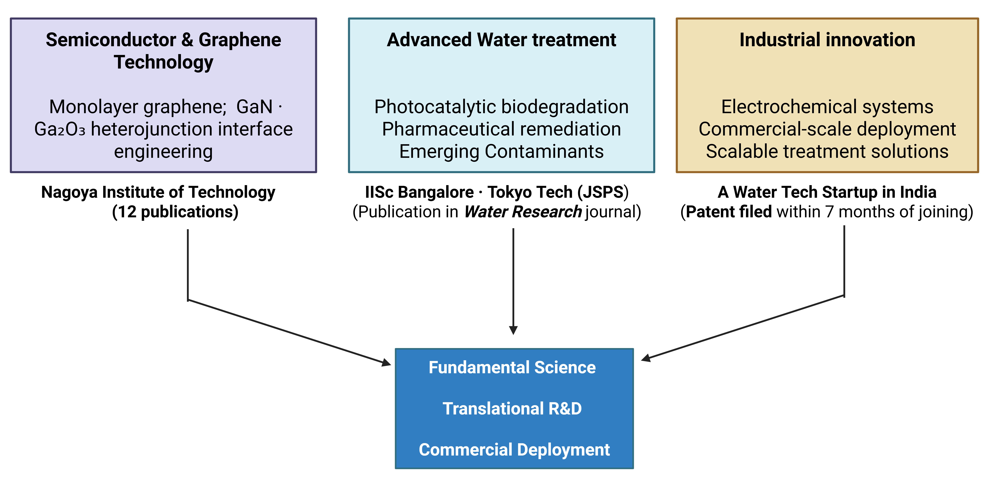

<!--

::: {style="text-align: justify"}

:::

-->

::: {style="text-align: justify"}

***Semiconductor & graphene engineering***

My doctoral research at Nagoya Institute of Technology focused on fabricating monolayer graphene using low-pressure chemical vapour deposition (CVD) and integrating it with wide band-gap semiconductors — gallium nitride (GaN) and gallium oxide (Ga₂O₃) — to develop self-powered UV and deep-UV photoresponsive heterojunction devices. The central contribution was a strategy to engineer the interfacial contact quality of graphene/GaN heterojunctions, establishing a direct correlation between interface quality and photogenerated charge carrier dynamics. This principle — that interface engineering governs electron transfer efficiency — became the foundation of all subsequent research. This work resulted in 12 publications across leading materials science journals and was highlighted internationally by graphene-info.com and nanowerk.com.

***Advanced water treatment***

Applying interface engineering principles to water treatment, I proposed and developed intimately coupled photocatalytic biodegradation (ICPB) systems using graphene-integrated biocarriers — first at the Indian Institute of Science (IOE-IISc Postdoctoral Fellowship, Bangalore) and subsequently at Tokyo Institute of Technology (JSPS Postdoctoral Fellowship). At Tokyo Tech, I proved that photoelectron transfer to biofilm is the fundamental mechanism governing ICPB efficiency, achieving complete degradation of tetracycline hydrochloride antibiotic with kinetic rates 13 times faster than conventional photocatalysis and 9 times faster than conventional biodegradation, alongside a 90% reduction in electrical energy per order of treatment. This breakthrough — directly targeting pharmaceutical and industrial organic pollutants — was published in Water Research (2025), one of the field's most prestigious journals.

***Industrial innovation***

Transitioning to industry at INDRA Water, I am applying this research depth to the development and commercial-scale implementation of electrochemical water treatment technologies. Within seven months of joining industry, I filed my first industrial patent — translating fundamental research into protectable commercial innovation at speed. This rapid translation reflects both the practical applicability of the underlying science and a deliberate commitment to building technology that creates lasting commercial value, not just academic output.

***The convergence***

These three pillars are not separate chapters — they are a single continuous research trajectory. Each stage applied the core methodology of the previous one to a harder, more commercially urgent problem. The result is a research profile that bridges fundamental materials science, advanced process engineering, and industrial deployment — underpinned by 12 peer-reviewed publications, 1 high-impact Water Research publication, and 1 industrial patent, across institutions in India and Japan.

:::